<div align="center">

# 🏋️ FitForge

### Forge your training. Fuel your body.

**A mobile-first personal trainer & nutrition guide that runs entirely in your browser** — no account, no server, no data leaving your device. The plan is shaped around *your* equipment, the movements you love, and the ones you'd rather never do again.

[](./LICENSE)
[](./apps/web)
[-D4A94E)](./apps/web/lib/demo/store.ts)
[](./apps/web/tests/e2e)
[](./turbo.json)

[**🚀 Live demo → goforge.fit**](https://goforge.fit/)

</div>

---

## 🚀 Live demo

### **→ [goforge.fit](https://goforge.fit/)**

The web app is a **static export** published to GitHub Pages on every push to `main`
([`.github/workflows/pages.yml`](./.github/workflows/pages.yml)).

It runs entirely client-side in **Local Mode** (the gold-on-dark "Forged Gold" theme): the real
deterministic rules from `@fitforge/shared`, the real curated catalog, and every byte of your data
in `localStorage`. **Start in Local Mode → answer 13 questions → get a generated plan → train, log,
eat, and track.** No sign-up, no backend, and a full backup / restore / erase in Settings.

> **Scope, stated plainly:** Local Mode is the whole product today. There is **no service worker**,
> so a cold page load still needs a network connection — but once the app is open a whole session
> runs with zero network calls, because the fonts, the catalog and the rules are all in the bundle.
> The single optional exception is the AI Coach ([below](#-coach--87-curated-answers-ai-optional)),
> which stays off unless you deploy the worker yourself.

Every screen below is captured by the Playwright suite at the canonical **390 × 664** phone
viewport (`apps/web/tests/e2e/screenshots.spec.ts` → `apps/web/tests/screenshots/`) and copied into
`docs/screenshots/` — so they are renders of the real app, not mockups.

|  |  |  |
|:--:|:--:|:--:|
| 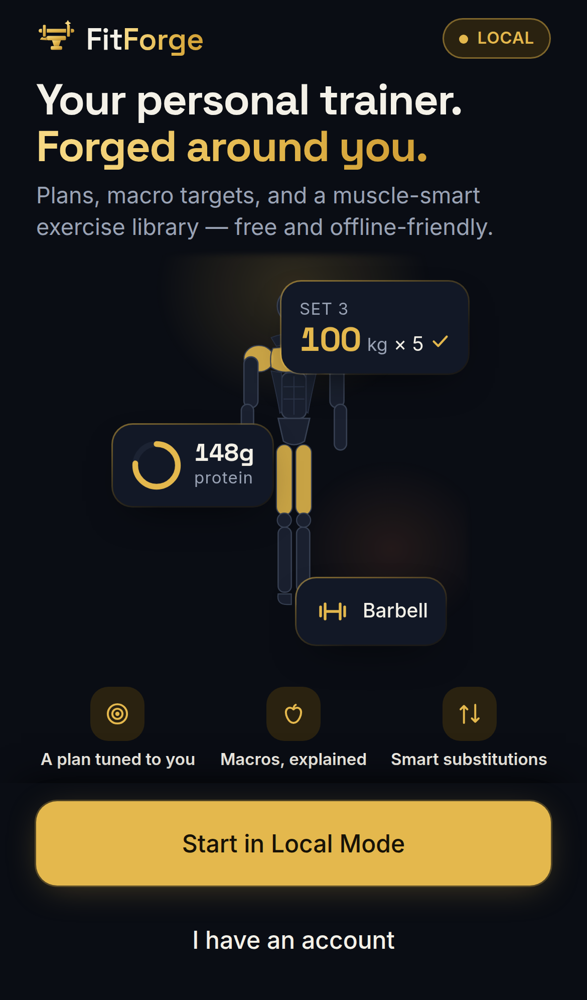 | 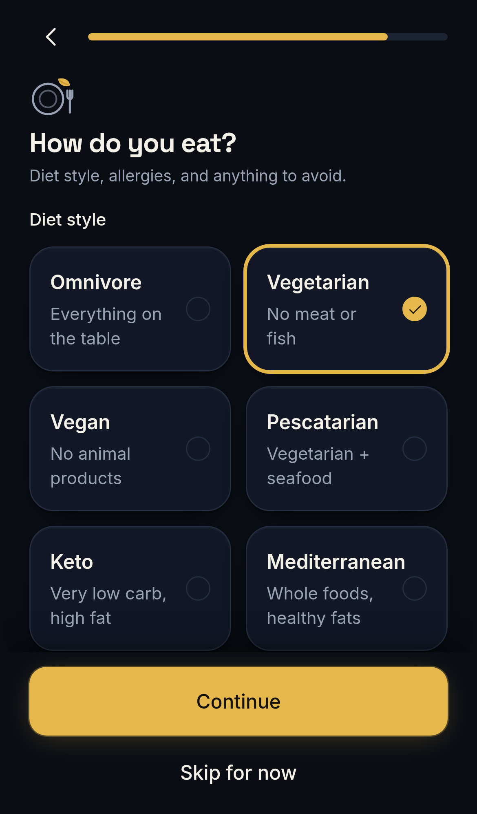 | 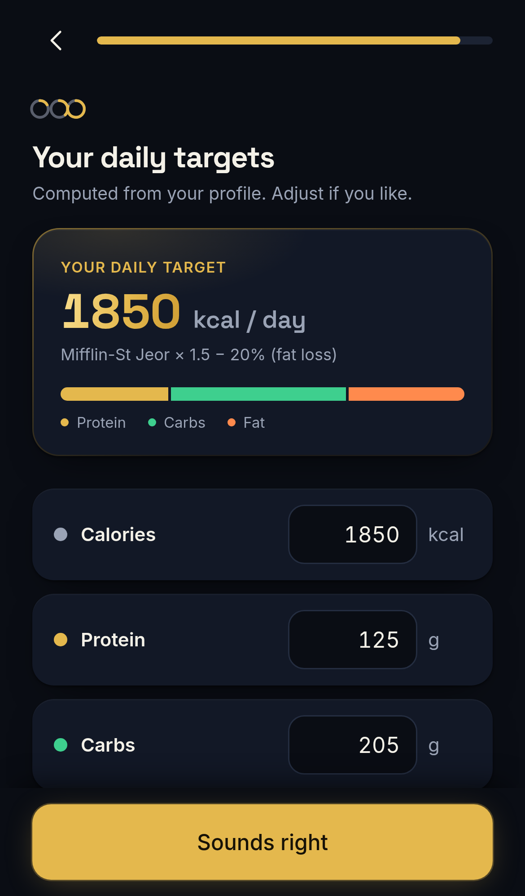 |
| **Landing** | **Preference onboarding** | **Computed macro targets** |
| 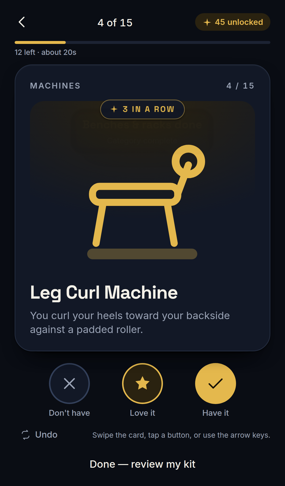 | 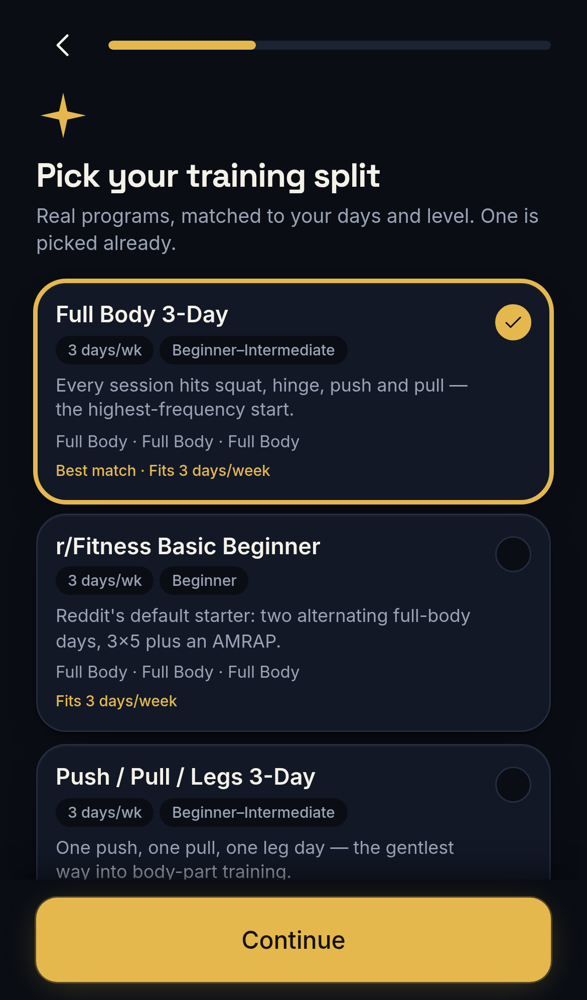 | 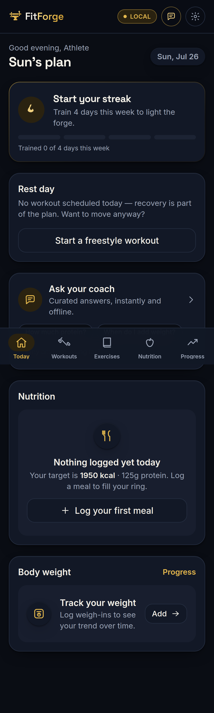 |
| **Equipment, as a swipe deck** | **26 real training splits** | **Today — generated plan** |
| 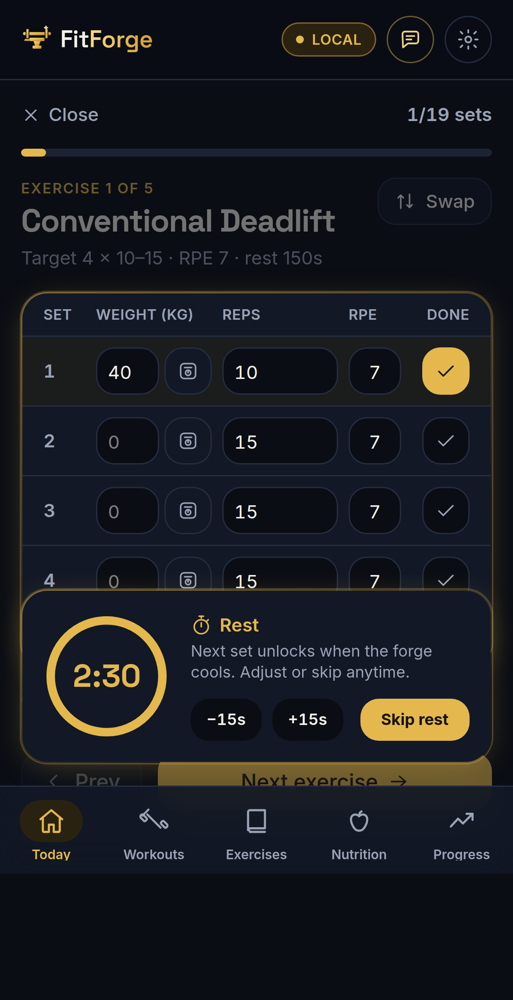 | 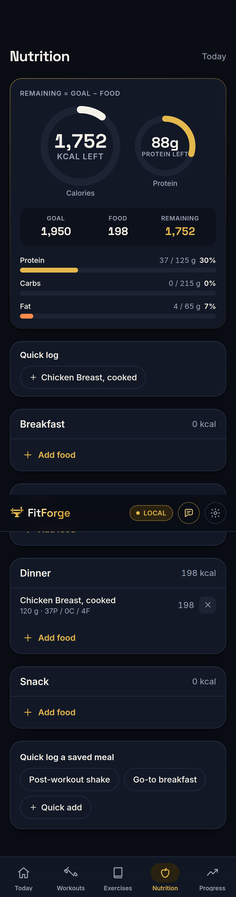 | 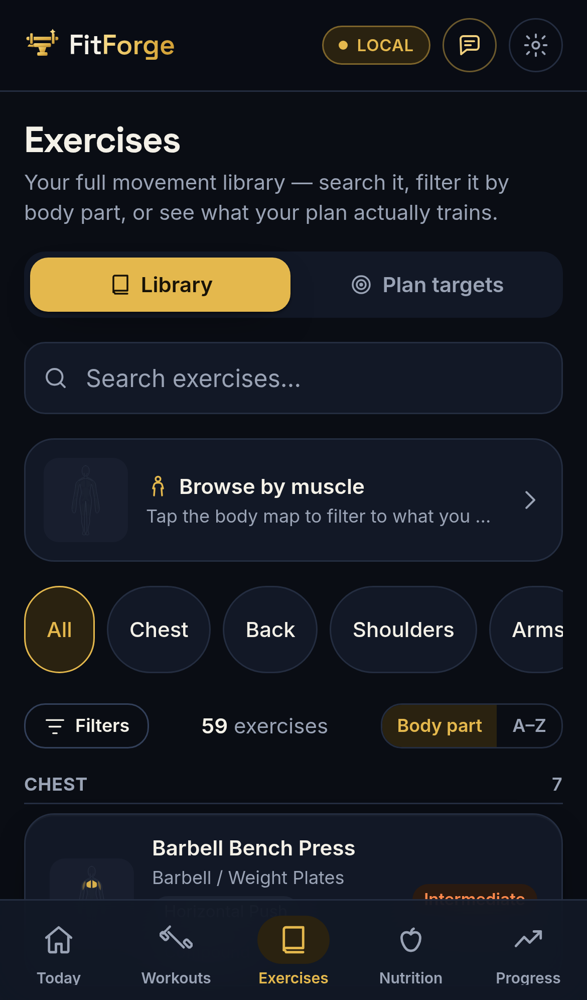 |
| **Workout player** | **Conversational food logging** | **91-exercise library** |
| 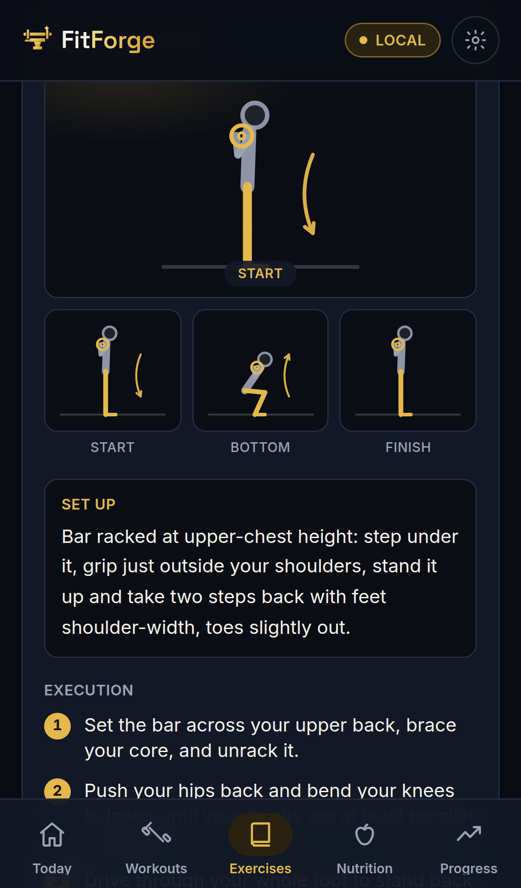 | 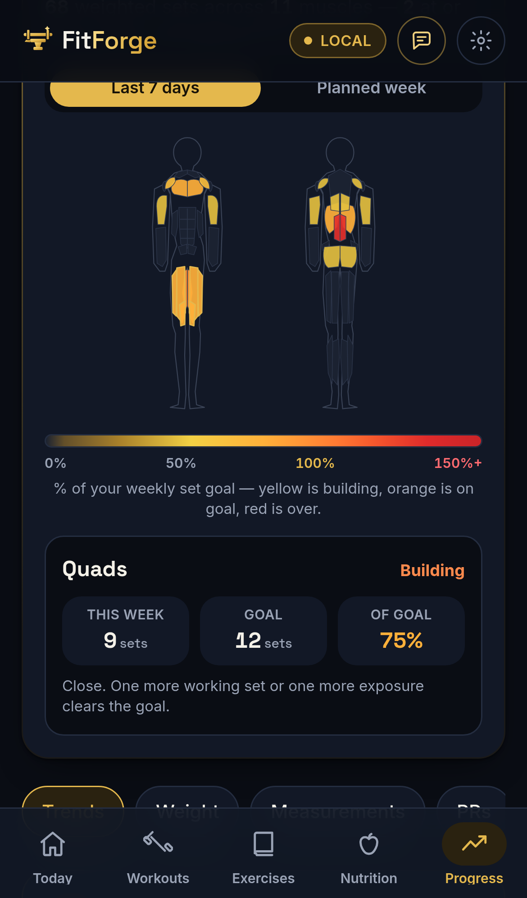 | 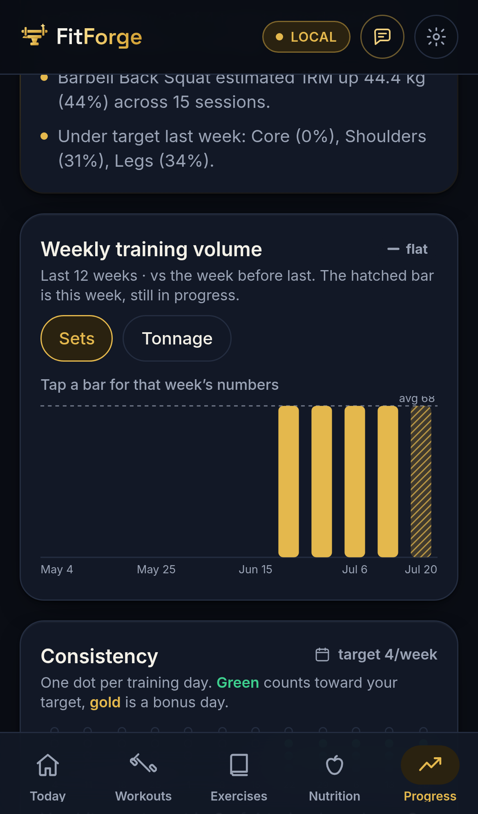 |
| **How to perform + substitutions** | **% of weekly volume goal** | **Trends** |

---

## ✨ What FitForge actually does

Most fitness apps hand you a generic plan and hope it sticks. FitForge starts the other way around:
a fast onboarding that learns your preferences, then a plan, a library and a nutrition surface all
built on that one profile.

- **🎛️ Preference-driven onboarding — 13 questions, 16 screens.** Goals (multi-select), experience,
  schedule, split, progression scheme, location, equipment, liked exercises, exclusions, body
  metrics, diet, target review, plan preview. Every step arrives pre-answered with a smart default,
  and equipment is a **swipe deck** rather than a wall of checkboxes. The draft persists
  write-through, so you can close the tab and resume exactly where you were.
- **🗓️ 26 real training programs, not "a split".** Full-body, upper/lower, PPL, PHUL, PHAT, bro
  split, Arnold, StrongLifts 5×5, Starting Strength, Greyskull LP, GZCLP, nSuns 5/3/1, Wendler
  5/3/1 BBB, Texas Method, Madcow, Strong Curves, plus home/dumbbell/kettlebell/bodyweight/athletic
  variants — spanning **2 to 6 days a week**. Each one previews its whole week (days, exercises,
  sets, reps, estimated minutes, muscles hit) *before* you commit to it.
- **📐 Progression schemes that shape every set.** Straight sets, top-set + backoff, or reverse
  pyramid. The player computes a **rep goal and a relative load for each individual set**, plus a
  real warm-up ramp — and a novice is never recommended into the heaviest-set-first scheme.
- **⚡ A quick-workout picker for the day the plan doesn't fit.** Pull the next scheduled day
  forward, run any single split day standalone, or **condense the whole split into one full-body
  session inside a time budget** — each option showing its real estimated duration and contents.
- **🔁 Equipment-aware substitution.** Excluded a movement, or don't own the machine? A
  deterministic scorer finds the best equivalent for the *same muscle and movement pattern*
  using only the gear you have, seeded by **73 curated substitution edges** and able to score
  equivalents nobody curated.
- **📊 Weekly volume targets you can calibrate — with citations.** Per-muscle hard-set goals
  (counted fractionally: primary 1.0, secondary 0.5), rendered as a body heat map coloured by
  **% of goal**. Tune any muscle between **4 and 30 sets/week**; every number is backed by sources
  shown in the app, not buried in a comment.
- **🥗 Nutrition that matches the training.** Macro targets from Mifflin–St Jeor → TDEE → goal
  adjustment, then **conversational logging**: type *"2 eggs and a slice of toast with butter"* and
  a fully local parser turns it into items you confirm before anything is written.
- **📈 Progress from your own logs.** Weekly volume trends, body-weight history, and personal records
  with an Epley e1RM — all derived from sessions you actually logged. Nothing is fabricated: a fresh
  account shows honest empty states, and the heat map falls back to your *planned* week, clearly
  labelled as planned.
- **🎬 A real motion layer.** Springs, press feedback, staggered list entrances and sheet
  transitions built on one shared vocabulary — with `prefers-reduced-motion` honoured globally
  rather than per-component.

> **Learned from [wger](https://github.com/wger-project/wger), rebuilt for mobile.** FitForge is
> *not* a wger fork. We studied wger's excellent open-source domain model (exercises, muscles,
> equipment, routines, nutrition) and re-designed it on a modern stack with a cleaner data model and
> a preference-first UX. See [`docs/decisions/`](./docs/decisions) for the design record.

---

## 📚 The catalog

Everything the app knows, curated in [`seed/data`](./seed/data) (the split library lives in
[`packages/shared`](./packages/shared/src/rules/splits.ts) and is generated into the seed from
there) and illustrated with self-authored SVG — no stock photography, no third-party media licences.

| Content | Count | Notes |
|---|---:|---|
| **Exercises** | **91** | **33 need no equipment at all** — a full home/travel programme without buying anything |
| Categories | 12 | chest · back · shoulders · arms · legs · glutes · core · cardio · full-body · conditioning · **Warm-up** · **Cooldown** |
| Movement patterns | 21 | squat, hinge, horizontal/vertical push & pull, carry, conditioning, mobility, static stretch, … |
| Warm-up (mobility) drills | 7 | arm circles, leg swings, cat-cow, world's greatest stretch, inchworm, band pull-apart, thoracic rotation |
| Cooldown (static stretch) | 8 | hamstring, hip flexor, pigeon, child's pose, doorway chest, calf, spinal twist, figure-four |
| Equipment | 31 curated / **28 offered** | the onboarding picker offers 28 (`lib/demo/catalog.ts`); `smith-machine`, `hip-thrust-machine` and `plyo-box` exist in the seed but are not selectable yet. 30 of the 31 have a hand-drawn portrait in [`components/illustrations/equipment`](./apps/web/components/illustrations/equipment) — `plyo-box` has none |
| Muscles | 20 | painted onto a front/back anatomy map |
| Training splits | 26 | 2–6 days per week |
| Curated substitution edges | **73 in the app** | the shipping scorer reads `packages/shared/src/fixtures/substitution-edges.json` (73 edges); `seed/data/substitutions.json` holds 132 for the SQL seed and has drifted ahead — see "Project status". Either way the scorer also finds uncurated equivalents |
| **Foods — tier 1 (bundled)** | **509** | in the bundle, answers instantly, values derived from public-domain USDA data |
| **Foods — tier 2 (built in CI)** | see below | USDA FoodData Central, fetched at deploy time |
| Coach knowledge base | 87 | curated Q&A across 10 categories, searched entirely on-device |

**Every one of the 91 exercises** carries the full teaching payload — setup, numbered instructions,
tempo, breathing, form cues, a *why this exercise* rationale, and common mistakes — plus a pose rig
that renders its positions as SVG.

### About the food-catalog numbers

- **Tier 1 is 509 foods and is always present.** It ships inside the bundle.
- **Tier 2 is a build artefact, not a committed file.** [`seed/import-usda.mjs`](./seed/import-usda.mjs)
  fetches USDA FoodData Central (public domain / CC0) during the Pages deploy and emits lazy shards
  under `public/food/`, loaded only when a query needs one. Foundation + SR Legacy contribute roughly
  10k lab-analysed generic foods, and the branded set is sampled to a **50,000-row default cap**, so
  a complete build lands in the **~50–60k** range.
- **It can legitimately be missing**, and the app is built to say so rather than pretend. If USDA is
  unreachable the deploy ships tier 1 only (`continue-on-error` in the workflow), search silently
  falls back, and the UI reports which catalog answered. **Nothing is ever invented**: a USDA row
  with no energy or macro values is dropped, not defaulted.

---

## 🧠 The intelligence layer (no LLM required)

FitForge's "smart" behaviour is **deterministic** — fast, explainable, testable, and free to run. It
lives in [`packages/shared/src/rules`](./packages/shared/src/rules) as pure TypeScript, covered by
116 unit tests.

| Capability | How it works | Source |
|---|---|---|
| **Smart defaults** | Goal × experience matrices → sets, reps, rest, weekly frequency | `rules/defaults.ts` |
| **Macro targets** | Mifflin–St Jeor BMR → TDEE → goal-adjusted calories + macro split | `rules/macros.ts` |
| **Exercise substitution** | Feasibility filter → exclusions → curated edges + weighted scoring over muscle overlap, movement pattern, mechanics, difficulty and popularity | `rules/substitution.ts` |
| **Split selection** | 26 named programs matched to your days/week, level and equipment | `rules/splits.ts` |
| **Progression schemes** | Per-set rep goals + relative loads, warm-up ramps, novice safety gate | `rules/progression.ts` |
| **Type-ahead search** | Fuzzy match + a popularity/prefix ranking score | `rules/search.ts` |
| **Food-sentence parsing** | Segment → quantity/unit/food words → resolve grams → per-item confidence | `apps/web/lib/food/parse.ts` |
| **Weekly volume goals** | Per-muscle hard-set targets, fractional counting, user calibration | `apps/web/components/features/shared/volumeMath.ts` |

### Loads are percentages, never invented kilos

The app does not know your 1RM, and guessing one is exactly the kind of fabricated number that gets
someone hurt. Progression schemes therefore express every set as a **percent of the day's top set** —
and on a movement with nothing to load they express it in **reps**, because "90% of your bodyweight"
is not a thing you can do.

### The volume numbers cite their sources — inside the app

Tap the evidence link next to any weekly target and you get the actual studies, with what each one
establishes:

| Source | What it establishes here |
|---|---|
| **Pelland et al., 2025** — meta-regression, 67 studies / 2,058 participants | Hypertrophy keeps improving with weekly sets but with strong diminishing returns past ~12–20 per muscle; volume is counted fractionally |
| **Baz-Valle et al., 2022** — systematic review | 12–20 weekly sets per muscle is the standard recommendation for young trained men |
| **Iversen et al., 2021** — *"No time to lift?"* | The minimum effective dose is ~4 hard sets per muscle per week — the app's floor, and the basis for condensed sessions |
| **Israetel et al.** — MEV/MAV/MRV landmarks | How the band is split *between* muscles — **flagged in-app as a practitioner framework, a lower evidence tier than the rows above** |

The same honesty applies to progression: the per-set drop, the ramp percentages and the rest
multipliers are **practitioner convention**, and `rules/progression.ts` says so out loud rather than
dressing them up as trial data.

---

## 🤖 Coach — 87 curated answers, AI optional

The Coach tab answers training and nutrition questions from an **on-device knowledge base**: 87
curated entries across getting-started, technique & safety, equipment & substitutions, progression &
plateaus, nutrition, recovery, cardio, body composition, demographics, and the app itself. Retrieval,
ranking and routing all run locally, with no network call.

Routing is confidence-based, and **safety comes first**:

```
RED FLAG (pain / injury / medical)  → safety card, always, before anything else
confidence ≥ 0.55                   → serve the curated answer instantly
0.30 ≤ confidence < 0.55            → show the top 3 questions to pick from, no AI call
confidence < 0.30                   → optional AI, grounded in those top 3 entries
```

The AI half is an **optional** Cloudflare Worker ([`workers/coach`](./workers/coach)), called only
when the knowledge base cannot confidently match. It stays **disabled unless you build with
`NEXT_PUBLIC_AI_ENDPOINT` set**, it never produces nutrient or training numbers, and every failure
mode — unconfigured, timeout, network, 5xx — degrades back to the local answer.

---

## 🏗️ Architecture

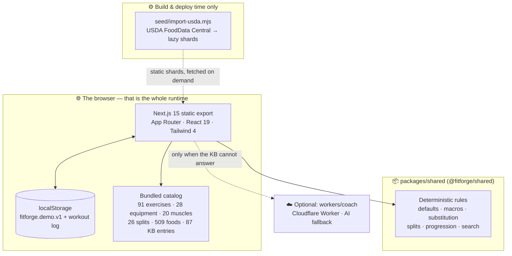

`output: 'export'` — there is no server, no API route and no runtime database. State lives in
`localStorage` behind a single module ([`apps/web/lib/demo/store.ts`](./apps/web/lib/demo/store.ts))
that **never trusts what it reads**: every value is normalised and repaired on load, so a corrupted
or hand-edited backup cannot crash a route or render `NaN`.

---

## 🗂️ Monorepo map

```
fitforge/
├── apps/
│   ├── web/            # Next.js 15 App Router — the shipping app (Local Mode, static export)
│   └── ios/            # SwiftUI scaffold — original MVP, see "Project status"
├── packages/
│   └── shared/         # @fitforge/shared — deterministic rules, zod schemas, DB types
├── seed/               # Curated content (equipment, muscles, exercises, splits, foods) + USDA importer
├── workers/
│   └── coach/          # Optional Cloudflare Worker for AI-assisted Coach answers
├── supabase/           # Original backend scaffold — see "Project status"
└── docs/               # Blueprint, architecture, research notes, ADRs
```

| Package | What's inside |
|---|---|
| [`apps/web`](./apps/web) | The app: 5 tab-bar destinations (Today · Workouts · Exercises · Nutrition · Progress) with Coach and Settings reachable from the shell chrome, a 16-screen onboarding, a design system, an SVG illustration system (poses, muscle map, equipment) and the motion layer |
| [`packages/shared`](./packages/shared) | The single TypeScript contract: pure-TS rules, zod validation, DB types — 116 unit tests |
| [`seed`](./seed) | 91 exercises · 31 equipment · 20 muscles · 12 categories · 26 splits · 132 substitution edges (SQL-seed copy), plus the USDA tier-2 importer |
| [`workers/coach`](./workers/coach) | Optional Workers-AI endpoint; the app is fully functional without it. Dashboard-only setup: [docs/CLOUDFLARE-WORKER-SETUP.md](./docs/CLOUDFLARE-WORKER-SETUP.md) |
| [`supabase`](./supabase) | Schema, RLS, RPCs and pgTAP tests from the original backend design |

---

## 🚀 Quick start

**Prerequisites:** Node ≥ 20, npm ≥ 10. That is it — the app needs no database, no Docker and no
environment variables to run.

```bash
# 1. Install workspace dependencies
npm install

# 2. Build the shared package (the web app imports its build output)
npm run build -w @fitforge/shared

# 3. Run the web app
npm run dev            # → http://localhost:3000
```

**Build the static export exactly as CI does:**

```bash
npm run build -w @fitforge/shared
cd apps/web
NEXT_PUBLIC_BASE_PATH="" NEXT_PUBLIC_DEMO=1 npm run build     # → apps/web/out
```

**Handy scripts:**

```bash
npm run typecheck                                # tsc across workspaces
npm run test -w @fitforge/shared                 # 116 rule/schema unit tests
npm run food:import:fixture                      # exercise the USDA importer offline, against a fixture
npm run seed:check                               # validate curated data (see "Project status")
cd apps/web && npx playwright test --workers=1   # 100 end-to-end tests
```

> ⚠️ **Always pass `--workers=1` to Playwright.** The suite serves the shared `out/` directory;
> parallel workers race on it and produce false results.

> ⚠️ **`food:import:fixture` writes a 5-food catalog into `apps/web/public/food/`.** It is a test
> of the importer, not a catalog — delete that directory afterwards (`rm -rf apps/web/public/food`)
> so a real build never ships it. The directory is gitignored, and CI cleans it in the same job.

---

## 🧭 The onboarding flow

Sixteen screens, thirteen of them questions, each pre-answered so you are correcting a guess rather
than filling in a blank. Every step persists write-through, so you can resume anytime.


Full behaviour — including per-screen autofill rules — lives in
[`docs/onboarding-spec.md`](./docs/onboarding-spec.md).

---

## 🧪 Testing & verification

| Suite | Size | Command |
|---|---:|---|
| Web end-to-end (Playwright, iPhone 13 profile) | **100 tests / 22 files** | `cd apps/web && npx playwright test --workers=1` |
| Shared rules & schemas (Vitest) | **116 tests / 7 files** | `npm run test -w @fitforge/shared` |
| Static export build | — | `npm run build -w @fitforge/web` |
| USDA importer smoke test (offline fixture) | — | `npm run food:import:fixture` |

The Playwright suite runs **against the real static export**, not a dev server — so `out/` has to
exist first:

```bash
npm run build -w @fitforge/shared
cd apps/web && NEXT_PUBLIC_BASE_PATH="" NEXT_PUBLIC_DEMO=1 npm run build
npx playwright test --workers=1
```

The end-to-end suite exists because **everything that defines this product is client-side**:
onboarding completing, a workout persisting to `localStorage`, the generator never producing an empty
day. `tsc` and `next build` cannot see any of it. Alongside the feature specs there are dedicated
regression suites for data integrity, plan generation, Coach safety routing, Settings, and the
geometry of the pose rigs.

---

## 🧭 Project status

**The web app is the product, and it is green:** typecheck, static export and all 100 end-to-end
tests pass, and CI ([`.github/workflows/ci.yml`](./.github/workflows/ci.yml)) runs the same checks on
every push.

Known gaps, stated rather than hidden:

- **The `seed` CI job is red: `npm run seed:check` and `npm run test -w @fitforge/seed` fail with 23
  errors.** The seed validator's enum lists were not extended when the catalog grew to 91 exercises,
  so it rejects the newer `conditioning` / `mobility` / `static_stretch` movement patterns and the
  `other` equipment category. **The data itself is fine** — the app, the static export and the e2e
  suite all consume it correctly, and the Pages deploy is a separate workflow that is unaffected; it
  is the validator that is out of date.
- **Two catalog fixtures have drifted behind `seed/data`.**
  `seed/data/substitutions.json` has 132 curated edges but the fixture the shipping app reads
  (`packages/shared/src/fixtures/substitution-edges.json`) has 73, so 59 hand-picked pairings are not
  reaching users — the scorer still returns sensible substitutes without them, since curated edges
  are a bonus term rather than a requirement. Separately, the onboarding equipment picker
  (`apps/web/lib/demo/catalog.ts`) offers 28 of the 31 seed items: `smith-machine`,
  `hip-thrust-machine` and `plyo-box` cannot be selected, so exercises requiring them are never
  unlocked.
- **No service worker.** The app is not installable-offline; a cold load needs a connection. Once
  loaded, a session makes no network calls.
- **Progress photos are session-only.** They are held in component state, and are neither persisted
  nor uploaded anywhere.
- **`apps/ios` and `supabase/` are the original MVP scaffold** and have not been touched since the
  first commit. They do **not** have the splits, progression schemes, volume calibration, expanded
  catalog, Coach or motion work the web app has grown. Treat them as the archived native/backend
  design record, not as shipping code.

Contributions welcome — see [`CONTRIBUTING.md`](./CONTRIBUTING.md).

---

## 📚 Documentation

| Doc | Purpose |
|---|---|
| [`docs/BLUEPRINT.md`](./docs/BLUEPRINT.md) | The authoritative design blueprint (product, schema, rules, seed) |
| [`docs/architecture.md`](./docs/architecture.md) | Condensed architecture & data model overview |
| [`docs/onboarding-spec.md`](./docs/onboarding-spec.md) | The onboarding flow + deterministic rule specs |
| [`docs/RESEARCH-VOLUME.md`](./docs/RESEARCH-VOLUME.md) | Volume landmarks, with the evidence tiers the app cites |
| [`docs/RESEARCH-PROGRESSION.md`](./docs/RESEARCH-PROGRESSION.md) | Progression schemes, and what the literature does (and does not) support |
| [`docs/RESEARCH-EXERCISES.md`](./docs/RESEARCH-EXERCISES.md) | Exercise catalog research |
| [`docs/RESEARCH-FOOD.md`](./docs/RESEARCH-FOOD.md) | Food databases + natural-language food parsing |
| [`docs/RESEARCH-KB.md`](./docs/RESEARCH-KB.md) | Coach knowledge base + routing thresholds |
| [`docs/RESEARCH-ONBOARDING.md`](./docs/RESEARCH-ONBOARDING.md) | Onboarding research prewalk |
| [`docs/POSE-AUDIT.md`](./docs/POSE-AUDIT.md) | Audit record for every exercise illustration |
| [`docs/api.md`](./docs/api.md) | REST resources, views and RPC surface (backend scaffold) |
| [`docs/decisions/`](./docs/decisions) | Architecture Decision Records |

---

## 📄 License

FitForge is released under the **[Creative Commons Attribution-ShareAlike 4.0 International](./LICENSE)** license (CC BY-SA 4.0).

> ℹ️ **Note:** Creative Commons licenses are designed for creative and content works and are *unusual for source code*. We use CC BY-SA 4.0 here by project preference for the whole repository (code, curated data, and docs). Third-party dependencies retain their own licenses. If you plan to build commercially on this code, review CC BY-SA's ShareAlike obligations carefully.

USDA FoodData Central data is a work of the U.S. federal government and is in the **public domain (CC0)**; the curated compilation in this repository is covered by the license above.

---

<div align="center">

**Nothing in this app is invented.** Every number on screen is computed from what you entered, cited
to a source, or labelled as an estimate.

</div>
