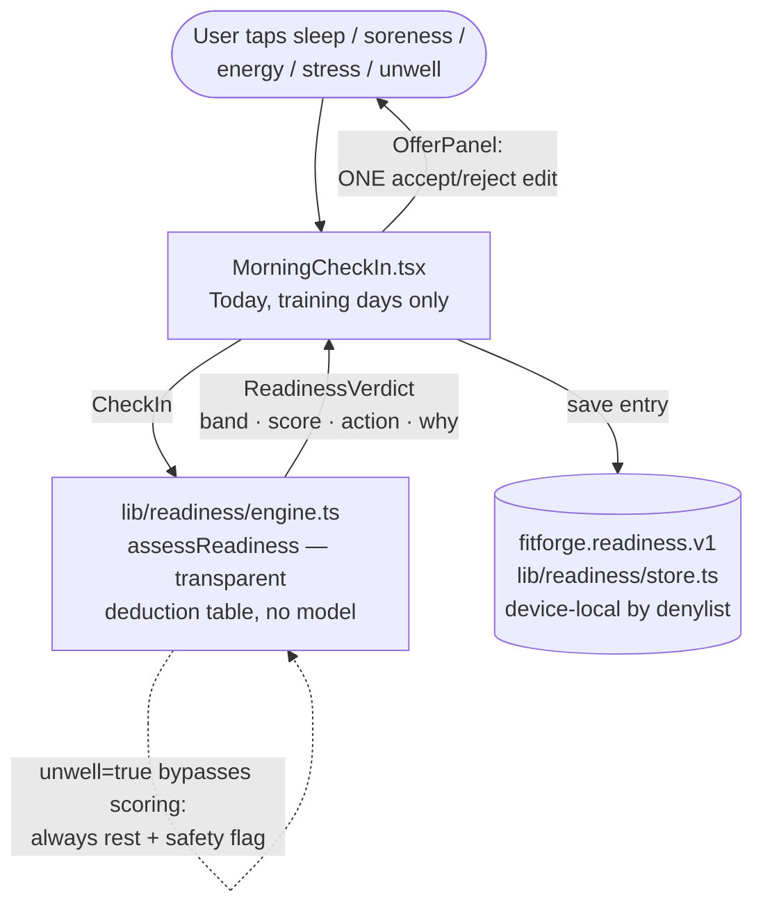
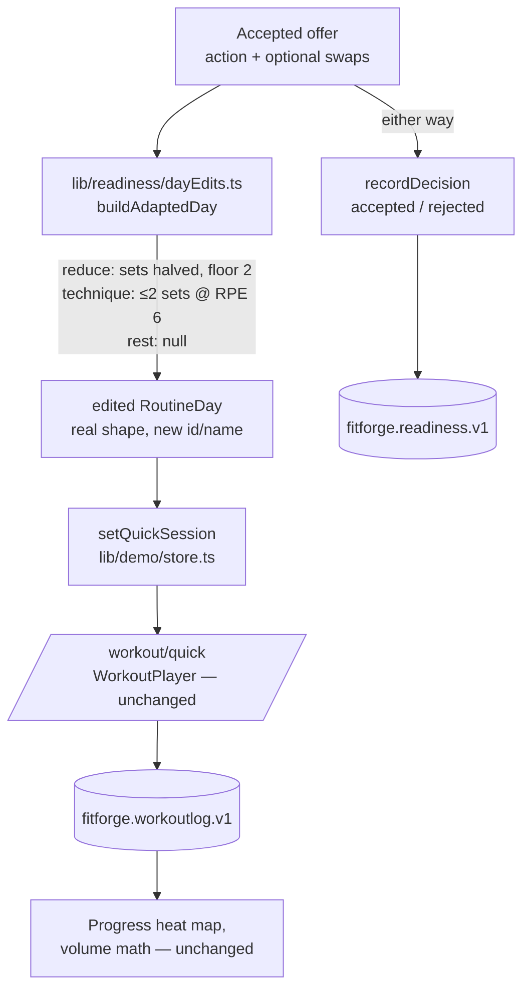
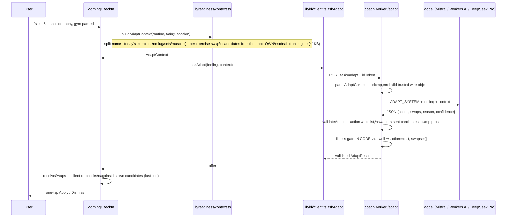
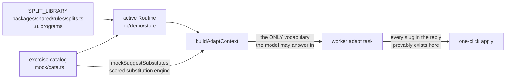
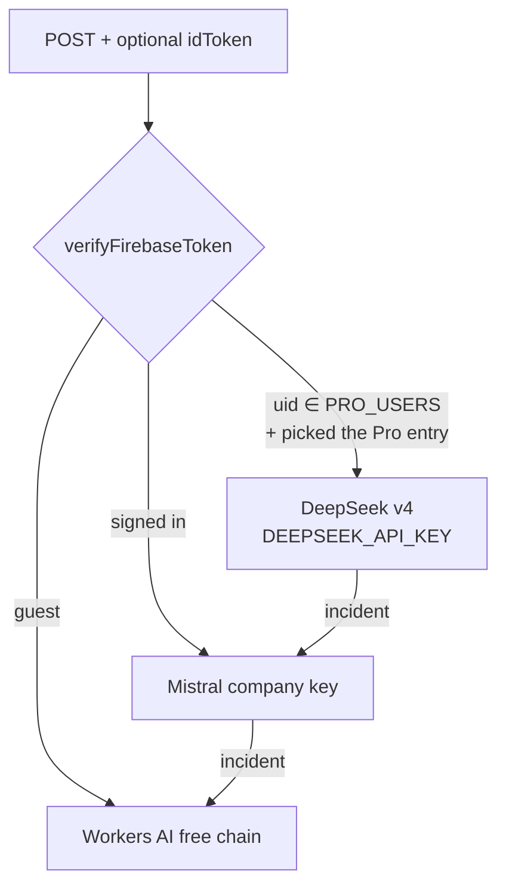

# Architecture · Readiness + AI adapt loop (dynamic split, phase 3)

How the morning check-in, the rules engine, the AI trainer and the plan-editing machinery
interconnect. One graph per element, then the composite. Every box names a real file.

## 1 · The morning check-in (rules path — works fully offline)

## 2 · Accept: recommendation → runnable session (shared by both paths)

## 3 · The AI path: describe it in your own words

## 4 · How the trainer "knows" the app's entities

The model never free-generates an exercise: the request carries the allowed vocabulary, the
worker discards anything outside it, and the client re-validates against the exact candidates it
sent. Three independent layers must all fail before an invented exercise could reach the plan.

## 5 · Model tiers in the worker (phase 2)

## 6 · Where HealthKit lands later

`assessReadiness(CheckIn)` is a pure function over an input object. The iOS shell (prewalk
phase 6) adds a provider that fills the same `CheckIn` from HealthKit daily aggregates instead
of sliders — engine, day edits, store, worker task and UI are all already built for it. Nothing
in this document changes.

## Safety invariants (tested)

- `unwell` can only ever produce `rest`: enforced in the client engine (`engine.test.ts`), AND
  independently in the worker after the model answers (`worker.test.ts`), AND pinned e2e
  (`readiness.spec.ts`).
- Actions are whitelisted at three layers; swaps must be client-proposed at two.
- Rules path (check-in → offer → apply) works with no network at all; the AI path is additive.
- `fitforge.readiness.v1` never rides the cloud sweep (`SYNC_DENYLIST_PREFIXES`), is included in
  deliberate file exports, and dies with erase-everything.
